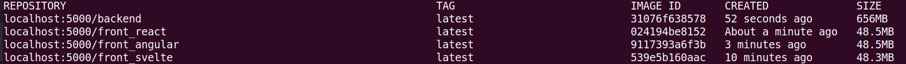

# Тестовый стенд для проведения эксперимента по изучению производительности рендеринга

## Сервисы
- Backend
- Front Angular
- Front React
- Front Svelte

## Установка
### Необходимы инструменты
- git
- docker
- kubernetes (minikube)
- helm
### Установка
1. Скачать репозиторий
    ```bash
    git clone https://github.com/klishin16/itmo-BKP-stand.git
    ```
2. Переключиться на ветку "kube"
    ```bash
    git checkout kube
    ```
3. Установить и запустить локально docker registry
   ```bash
    docker run -d -p 5000:5000 --restart=always --name registry registry:2
    ```
4. Выполнить сборку Docker образов для каждого сервиса
    ```bash
    docker build ./front-angular -t localhost:5000/front_angular:latest
    ```
    ```bash
    docker build ./front-react -t localhost:5000/front_react:latest
    ```
    ```bash
    docker build ./front-svelte -t localhost:5000/front_svelte:latest
    ```
    ```bash
    docker build ./backend -t localhost:5000/backend:latest
    ```
   Команда ```docker images``` должна содержать следующую информацию:
   
5. Загрузить образы в docker registry
   ```bash
    docker push localhost:5000/front_angular:latest
    ```
    ```bash
    docker push localhost:5000/front_react:latest
    ```
    ```bash
    docker push localhost:5000/front_svelte:latest
    ```
    ```bash
    docker push localhost:5000/backend:latest
    ```
6. Создать пространство имен kubernetes
    ```bash
    kubectl create namespace kp-stand
    ```
7. Развернуть сервисы в кластере kubernetes
    ```bash
    helm install -n kp-stand -f ./kp-stand-chart/values.yaml kp-stand  ./kp-stand-chart
    ```
8. Добавить DNS записи в `/etc/hosts`, где `192.168.49.2` kubernetes ip (для minikube можно узнать командой `minikube ip`)
   ```bash
   192.168.49.2 front-react.local.dev
   192.168.49.2 front-angular.local.dev
   192.168.49.2 front-svelte.local.dev
   192.168.49.2 backend.local.dev
   ```
